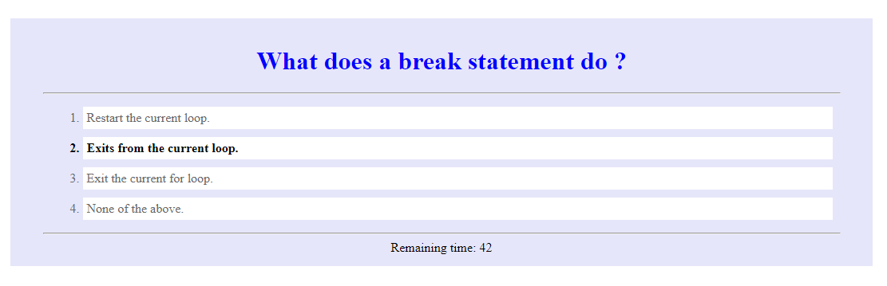

# homework04
This project provides a quick quiz for any subject. By changing the array 'questions', the quiz changes dinamically. The number of questions and possible answers can be changed, and the javascript program will randomly shows them. At the end, user name will be demanded and 
the top five scores saved will be shown.

[Project Source Code](https://github.com/correaph/homework04.git)

